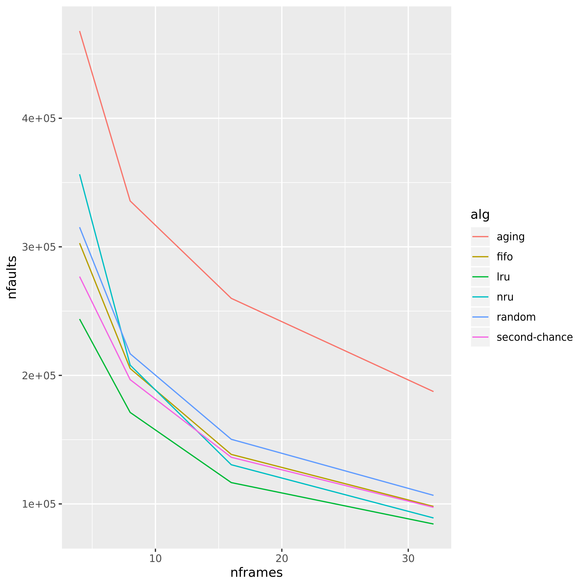
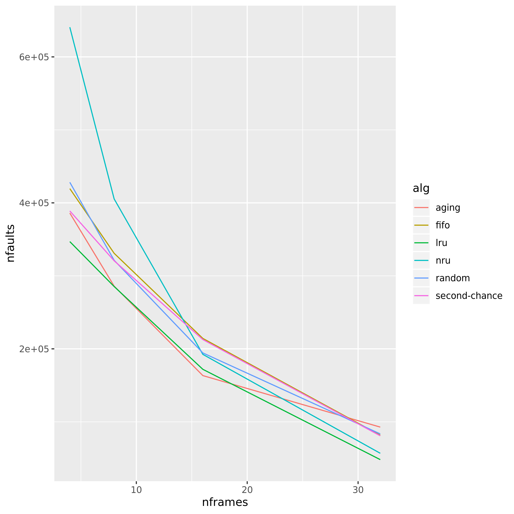

# Políticas de reposição de páginas

Teste 1

Teste 2

### First in, first out (FIFO)

A primeira política a ser testada é a FIFO, que funciona basicamente como uma fila. No seu funcionamento, cada vez que ocorre um page fault decorrente da página não estar alocada na memória física, o algoritmo busca a página e coloca ela enfileirada na memória. Quando a memória está cheia e ocorre um page fault, o algoritmo retira a página correspondente à cabeça da fila, abrindo espaço para o novo frame (que ficará então no fim da fila). Um problema inerente a esta política é que não há otimização para permanência das páginas mais usadas na memória física. No gráfico, podemos ver que é uma das políticas menos eficientes, sendo às vezes a pior das estudadas.

### Second chance

A segunda política é um aprimoramento da anterior. Ela funciona como a FIFO, entretanto cada frame possui um bit indicando se a página foi referenciada recentemente ou não. No momento da remoção, o algoritmo checa se o bit está definido como 1. Caso não esteja a página é removida, e caso esteja o algoritmo define o bit como 0 e põe a frame no fim da fila (dando uma "segunda chance" a ele). Sua eficiência é similar ao do FIFO, apesar de um pouco melhor.

### Least Recently Used (LRU)

A terceira política a ser testada é a LRU, que implementamos utilizando um deque.Como ela funciona? Caso haja memória livre, a cada page fault adicionaremos a página no início do deque. Se uma página alocada na memória for acessada, esta página será realocada para o início da deque. Por outro lado, caso a memória esteja cheia e ocorra um page fault, o algoritmo irá remover da memória física a página que foi acessada há mais tempo (ou seja, que está no fim da deque), e a página nova irá pro início. Esta política é bem mais efetiva que o FIFO, já que se aproveita da história de uso da memória, evitando que páginas recentemente usadas (e que possivelmente serão usadas novamente, dependendo do processo) sejam removidas da memória física. Como imaginado, o gráfico nos mostra que a LRU é bem mais eficiente, sendo na maior parte das vezes **a mais eficiente**.

### Not Recently Used (NRU)

A penúltima política testada se chama Not Recently Used. Ela assim como a LRU utiliza-se da história de uso, esta também, entretanto de forma diferente. Cadaframe tem dois bits indicando se a) o frame foi referenciado e b) o frame foi modificado. A partir disto, criamos uma hierarquia entre as páginas da memória: Primeiro, frames referenciados e modificados; Segundo, frames referenciados; Terceiro, frames modificados, e por último, frames não referenciados nem modificados. Após um intervalo especificado, uma interrupção de clock é interceptada e todos os frames da lista são colocados como não referenciados. Legal, mas como funciona a reposição de páginas? Caso haja a necessidade de repor uma página, o algoritmo escolherá aleatoriamente uma página da categoria de menor importância disponível. O algoritmo tem a vantagem de evitar que páginas recentemente referenciadas ou modificadas sejam removidas da memória física e considera que páginas da pior categoria tem chances iguais de serem removidas da memória física. No gráfico, podemos ver que o algoritmo é bem eficiente quando há um maior número de frames disponíveis (por causa de uma melhor distribuição hierárquica).

### Aging

Por último, temos o algoritmo Aging, que é similar ao algoritmo LRU, porém leva em consideração uma quantidade especificada de intervalos, removendo a página que nestes intervalos de tempo foi menos utilizada. É um algoritmo que assim como o LRU é bastante eficiente. Por algum motivo, no primeiro gráfico o aging está funcionando diferente do esperado.

Referências:

ARPACI-DUSSEAU; ARPACI-DUSSEAU. Operating Systems: Three Easy Pieces. Disponível em: http://pages.cs.wisc.edu/~remzi/OSTEP/
Page Replacemente Algorithms. Disponível em https://en.wikipedia.org/wiki/Page_replacement_algorithm
